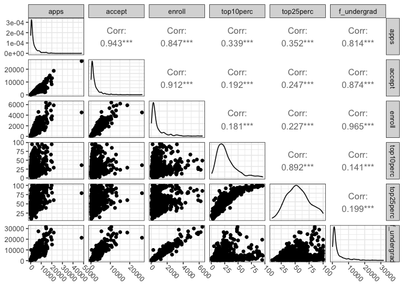
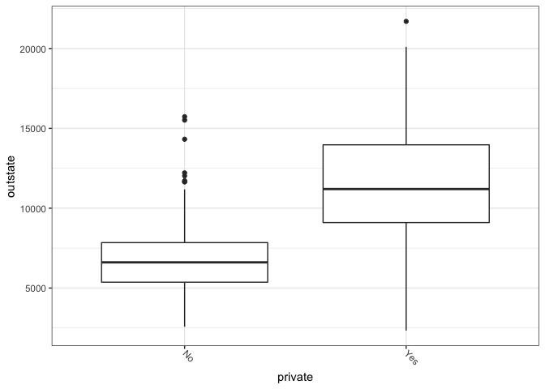

Chapter 2 Excercises
================

Code and solutions for Chapter 2 of the [Introduction to Statistical
Learning](https://www.statlearning.com) textbook by G. James, D. Witten,
T. Hastie and R. Tibshirani.

``` r
library(tidyverse)
```

    ## ── Attaching packages ─────────────────────────────────────── tidyverse 1.3.1 ──

    ## ✓ ggplot2 3.3.5     ✓ purrr   0.3.4
    ## ✓ tibble  3.1.4     ✓ dplyr   1.0.7
    ## ✓ tidyr   1.1.3     ✓ stringr 1.4.0
    ## ✓ readr   2.0.1     ✓ forcats 0.5.1

    ## ── Conflicts ────────────────────────────────────────── tidyverse_conflicts() ──
    ## x dplyr::filter() masks stats::filter()
    ## x dplyr::lag()    masks stats::lag()

``` r
library(skimr)
library(ggthemes)
library(GGally)
```

    ## Registered S3 method overwritten by 'GGally':
    ##   method from   
    ##   +.gg   ggplot2

Set the palette and the running theme for ggplot2.

``` r
theme_set(theme_bw())
theme_update(axis.text.x = element_text(
angle = -45,
hjust = 0,
vjust = 0.5
))
```

## Ex. 8

Read the College data

``` r
college <- read_csv("data/College.csv") %>%
  rename(college = ...1) %>%
  rename_with(~ tolower(gsub(".", "_", .x, fixed = TRUE)))
```

    ## New names:
    ## * `` -> ...1

    ## Rows: 777 Columns: 19

    ## ── Column specification ────────────────────────────────────────────────────────
    ## Delimiter: ","
    ## chr  (2): ...1, Private
    ## dbl (17): Apps, Accept, Enroll, Top10perc, Top25perc, F.Undergrad, P.Undergr...

    ## 
    ## ℹ Use `spec()` to retrieve the full column specification for this data.
    ## ℹ Specify the column types or set `show_col_types = FALSE` to quiet this message.

``` r
glimpse(college)
```

    ## Rows: 777
    ## Columns: 19
    ## $ college     <chr> "Abilene Christian University", "Adelphi University", "Adr…
    ## $ private     <chr> "Yes", "Yes", "Yes", "Yes", "Yes", "Yes", "Yes", "Yes", "Y…
    ## $ apps        <dbl> 1660, 2186, 1428, 417, 193, 587, 353, 1899, 1038, 582, 173…
    ## $ accept      <dbl> 1232, 1924, 1097, 349, 146, 479, 340, 1720, 839, 498, 1425…
    ## $ enroll      <dbl> 721, 512, 336, 137, 55, 158, 103, 489, 227, 172, 472, 484,…
    ## $ top10perc   <dbl> 23, 16, 22, 60, 16, 38, 17, 37, 30, 21, 37, 44, 38, 44, 23…
    ## $ top25perc   <dbl> 52, 29, 50, 89, 44, 62, 45, 68, 63, 44, 75, 77, 64, 73, 46…
    ## $ f_undergrad <dbl> 2885, 2683, 1036, 510, 249, 678, 416, 1594, 973, 799, 1830…
    ## $ p_undergrad <dbl> 537, 1227, 99, 63, 869, 41, 230, 32, 306, 78, 110, 44, 638…
    ## $ outstate    <dbl> 7440, 12280, 11250, 12960, 7560, 13500, 13290, 13868, 1559…
    ## $ room_board  <dbl> 3300, 6450, 3750, 5450, 4120, 3335, 5720, 4826, 4400, 3380…
    ## $ books       <dbl> 450, 750, 400, 450, 800, 500, 500, 450, 300, 660, 500, 400…
    ## $ personal    <dbl> 2200, 1500, 1165, 875, 1500, 675, 1500, 850, 500, 1800, 60…
    ## $ phd         <dbl> 70, 29, 53, 92, 76, 67, 90, 89, 79, 40, 82, 73, 60, 79, 36…
    ## $ terminal    <dbl> 78, 30, 66, 97, 72, 73, 93, 100, 84, 41, 88, 91, 84, 87, 6…
    ## $ s_f_ratio   <dbl> 18.1, 12.2, 12.9, 7.7, 11.9, 9.4, 11.5, 13.7, 11.3, 11.5, …
    ## $ perc_alumni <dbl> 12, 16, 30, 37, 2, 11, 26, 37, 23, 15, 31, 41, 21, 32, 26,…
    ## $ expend      <dbl> 7041, 10527, 8735, 19016, 10922, 9727, 8861, 11487, 11644,…
    ## $ grad_rate   <dbl> 60, 56, 54, 59, 15, 55, 63, 73, 80, 52, 73, 76, 74, 68, 55…

``` r
college %>%
  select(-college) %>%
  skim()
```

|                                                  |            |
|:-------------------------------------------------|:-----------|
| Name                                             | Piped data |
| Number of rows                                   | 777        |
| Number of columns                                | 18         |
| \_\_\_\_\_\_\_\_\_\_\_\_\_\_\_\_\_\_\_\_\_\_\_   |            |
| Column type frequency:                           |            |
| character                                        | 1          |
| numeric                                          | 17         |
| \_\_\_\_\_\_\_\_\_\_\_\_\_\_\_\_\_\_\_\_\_\_\_\_ |            |
| Group variables                                  | None       |

Data summary

**Variable type: character**

| skim\_variable | n\_missing | complete\_rate | min | max | empty | n\_unique | whitespace |
|:---------------|-----------:|---------------:|----:|----:|------:|----------:|-----------:|
| private        |          0 |              1 |   2 |   3 |     0 |         2 |          0 |

**Variable type: numeric**

| skim\_variable | n\_missing | complete\_rate |     mean |      sd |     p0 |    p25 |    p50 |     p75 |    p100 | hist  |
|:---------------|-----------:|---------------:|---------:|--------:|-------:|-------:|-------:|--------:|--------:|:------|
| apps           |          0 |              1 |  3001.64 | 3870.20 |   81.0 |  776.0 | 1558.0 |  3624.0 | 48094.0 | ▇▁▁▁▁ |
| accept         |          0 |              1 |  2018.80 | 2451.11 |   72.0 |  604.0 | 1110.0 |  2424.0 | 26330.0 | ▇▁▁▁▁ |
| enroll         |          0 |              1 |   779.97 |  929.18 |   35.0 |  242.0 |  434.0 |   902.0 |  6392.0 | ▇▁▁▁▁ |
| top10perc      |          0 |              1 |    27.56 |   17.64 |    1.0 |   15.0 |   23.0 |    35.0 |    96.0 | ▇▇▂▁▁ |
| top25perc      |          0 |              1 |    55.80 |   19.80 |    9.0 |   41.0 |   54.0 |    69.0 |   100.0 | ▂▆▇▅▃ |
| f\_undergrad   |          0 |              1 |  3699.91 | 4850.42 |  139.0 |  992.0 | 1707.0 |  4005.0 | 31643.0 | ▇▁▁▁▁ |
| p\_undergrad   |          0 |              1 |   855.30 | 1522.43 |    1.0 |   95.0 |  353.0 |   967.0 | 21836.0 | ▇▁▁▁▁ |
| outstate       |          0 |              1 | 10440.67 | 4023.02 | 2340.0 | 7320.0 | 9990.0 | 12925.0 | 21700.0 | ▃▇▆▂▂ |
| room\_board    |          0 |              1 |  4357.53 | 1096.70 | 1780.0 | 3597.0 | 4200.0 |  5050.0 |  8124.0 | ▂▇▆▂▁ |
| books          |          0 |              1 |   549.38 |  165.11 |   96.0 |  470.0 |  500.0 |   600.0 |  2340.0 | ▇▆▁▁▁ |
| personal       |          0 |              1 |  1340.64 |  677.07 |  250.0 |  850.0 | 1200.0 |  1700.0 |  6800.0 | ▇▃▁▁▁ |
| phd            |          0 |              1 |    72.66 |   16.33 |    8.0 |   62.0 |   75.0 |    85.0 |   103.0 | ▁▁▅▇▅ |
| terminal       |          0 |              1 |    79.70 |   14.72 |   24.0 |   71.0 |   82.0 |    92.0 |   100.0 | ▁▁▃▆▇ |
| s\_f\_ratio    |          0 |              1 |    14.09 |    3.96 |    2.5 |   11.5 |   13.6 |    16.5 |    39.8 | ▁▇▂▁▁ |
| perc\_alumni   |          0 |              1 |    22.74 |   12.39 |    0.0 |   13.0 |   21.0 |    31.0 |    64.0 | ▅▇▆▂▁ |
| expend         |          0 |              1 |  9660.17 | 5221.77 | 3186.0 | 6751.0 | 8377.0 | 10830.0 | 56233.0 | ▇▁▁▁▁ |
| grad\_rate     |          0 |              1 |    65.46 |   17.18 |   10.0 |   53.0 |   65.0 |    78.0 |   118.0 | ▁▅▇▅▁ |

``` r
college %>%
  select(3:8) %>%
  ggpairs()
```

<!-- -->

``` r
college %>%
  ggplot(aes(x = private, y = outstate)) +
  geom_boxplot()
```

<!-- -->

``` r
college <- college %>%
  mutate(elite = ifelse(top10perc > 50, "Yes", "No"))

glimpse(college)
```

    ## Rows: 777
    ## Columns: 20
    ## $ college     <chr> "Abilene Christian University", "Adelphi University", "Adr…
    ## $ private     <chr> "Yes", "Yes", "Yes", "Yes", "Yes", "Yes", "Yes", "Yes", "Y…
    ## $ apps        <dbl> 1660, 2186, 1428, 417, 193, 587, 353, 1899, 1038, 582, 173…
    ## $ accept      <dbl> 1232, 1924, 1097, 349, 146, 479, 340, 1720, 839, 498, 1425…
    ## $ enroll      <dbl> 721, 512, 336, 137, 55, 158, 103, 489, 227, 172, 472, 484,…
    ## $ top10perc   <dbl> 23, 16, 22, 60, 16, 38, 17, 37, 30, 21, 37, 44, 38, 44, 23…
    ## $ top25perc   <dbl> 52, 29, 50, 89, 44, 62, 45, 68, 63, 44, 75, 77, 64, 73, 46…
    ## $ f_undergrad <dbl> 2885, 2683, 1036, 510, 249, 678, 416, 1594, 973, 799, 1830…
    ## $ p_undergrad <dbl> 537, 1227, 99, 63, 869, 41, 230, 32, 306, 78, 110, 44, 638…
    ## $ outstate    <dbl> 7440, 12280, 11250, 12960, 7560, 13500, 13290, 13868, 1559…
    ## $ room_board  <dbl> 3300, 6450, 3750, 5450, 4120, 3335, 5720, 4826, 4400, 3380…
    ## $ books       <dbl> 450, 750, 400, 450, 800, 500, 500, 450, 300, 660, 500, 400…
    ## $ personal    <dbl> 2200, 1500, 1165, 875, 1500, 675, 1500, 850, 500, 1800, 60…
    ## $ phd         <dbl> 70, 29, 53, 92, 76, 67, 90, 89, 79, 40, 82, 73, 60, 79, 36…
    ## $ terminal    <dbl> 78, 30, 66, 97, 72, 73, 93, 100, 84, 41, 88, 91, 84, 87, 6…
    ## $ s_f_ratio   <dbl> 18.1, 12.2, 12.9, 7.7, 11.9, 9.4, 11.5, 13.7, 11.3, 11.5, …
    ## $ perc_alumni <dbl> 12, 16, 30, 37, 2, 11, 26, 37, 23, 15, 31, 41, 21, 32, 26,…
    ## $ expend      <dbl> 7041, 10527, 8735, 19016, 10922, 9727, 8861, 11487, 11644,…
    ## $ grad_rate   <dbl> 60, 56, 54, 59, 15, 55, 63, 73, 80, 52, 73, 76, 74, 68, 55…
    ## $ elite       <chr> "No", "No", "No", "Yes", "No", "No", "No", "No", "No", "No…

``` r
college %>%
  count(elite)
```

    ## # A tibble: 2 × 2
    ##   elite     n
    ##   <chr> <int>
    ## 1 No      699
    ## 2 Yes      78

Document the information about the analysis session

``` r
sessionInfo()
```

    ## R version 4.1.1 (2021-08-10)
    ## Platform: x86_64-apple-darwin17.0 (64-bit)
    ## Running under: macOS Big Sur 10.16
    ## 
    ## Matrix products: default
    ## BLAS:   /Library/Frameworks/R.framework/Versions/4.1/Resources/lib/libRblas.0.dylib
    ## LAPACK: /Library/Frameworks/R.framework/Versions/4.1/Resources/lib/libRlapack.dylib
    ## 
    ## locale:
    ## [1] en_US.UTF-8/en_US.UTF-8/en_US.UTF-8/C/en_US.UTF-8/en_US.UTF-8
    ## 
    ## attached base packages:
    ## [1] stats     graphics  grDevices datasets  utils     methods   base     
    ## 
    ## other attached packages:
    ##  [1] GGally_2.1.2    ggthemes_4.2.4  skimr_2.1.3     forcats_0.5.1  
    ##  [5] stringr_1.4.0   dplyr_1.0.7     purrr_0.3.4     readr_2.0.1    
    ##  [9] tidyr_1.1.3     tibble_3.1.4    ggplot2_3.3.5   tidyverse_1.3.1
    ## 
    ## loaded via a namespace (and not attached):
    ##  [1] Rcpp_1.0.7         lubridate_1.7.10   assertthat_0.2.1   digest_0.6.27     
    ##  [5] utf8_1.2.2         R6_2.5.1           cellranger_1.1.0   plyr_1.8.6        
    ##  [9] repr_1.1.3         backports_1.2.1    reprex_2.0.1       evaluate_0.14     
    ## [13] highr_0.9          httr_1.4.2         pillar_1.6.2       rlang_0.4.11      
    ## [17] readxl_1.3.1       rstudioapi_0.13    rmarkdown_2.11     labeling_0.4.2    
    ## [21] bit_4.0.4          munsell_0.5.0      broom_0.7.9        compiler_4.1.1    
    ## [25] modelr_0.1.8       xfun_0.26          pkgconfig_2.0.3    base64enc_0.1-3   
    ## [29] htmltools_0.5.2    tidyselect_1.1.1   reshape_0.8.8      fansi_0.5.0       
    ## [33] crayon_1.4.1       tzdb_0.1.2         dbplyr_2.1.1       withr_2.4.2       
    ## [37] grid_4.1.1         jsonlite_1.7.2     gtable_0.3.0       lifecycle_1.0.0   
    ## [41] DBI_1.1.1          magrittr_2.0.1     scales_1.1.1       vroom_1.5.5       
    ## [45] cli_3.0.1          stringi_1.7.4      farver_2.1.0       renv_0.14.0       
    ## [49] fs_1.5.0           xml2_1.3.2         ellipsis_0.3.2     generics_0.1.0    
    ## [53] vctrs_0.3.8        RColorBrewer_1.1-2 tools_4.1.1        bit64_4.0.5       
    ## [57] glue_1.4.2         hms_1.1.0          parallel_4.1.1     fastmap_1.1.0     
    ## [61] yaml_2.2.1         colorspace_2.0-2   rvest_1.0.1        knitr_1.34        
    ## [65] haven_2.4.3
